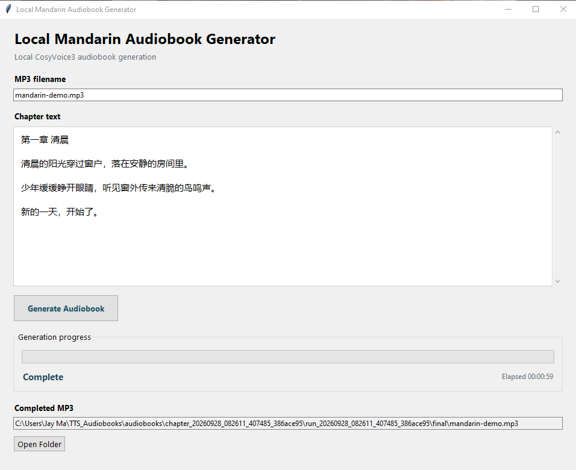

# Local Mandarin Audiobook Generator



**Neural Multilingual TTS** is a local Windows app for turning Mandarin novel chapters into audiobooks. Paste a chapter into the Tkinter app, choose an MP3 filename, and generate a narrated audiobook with a consistent Xiaoxiao-style zero-shot voice. CosyVoice3 RL runs locally in WSL; the app handles progress, bounded quality checks and retries, and MP3 export without a cloud usage quota, while keeping audio and job data on the local machine.

## Key Features

- **Simple Windows workflow:** paste UTF-8 Chinese text, click **Generate Audiobook**, follow progress and elapsed time, then open the completed MP3 folder.
- **Consistent narrator:** a pinned CosyVoice3 RL model and short Xiaoxiao-style reference are used across chapters.
- **Reliable long-form generation:** chapter text is frozen into deterministic units with recorded source spans, seeds, attempts, and selections.
- **Built-in quality checks:** Mandarin content QC catches substantial omissions; verified units over the supported length are retried. Each unit has a bounded attempt budget.
- **Safe recovery:** interrupted or failed runs can resume from recorded state while keeping accepted units and earlier attempt evidence.
- **Exact audio assembly:** selected unit PCM is joined into a canonical WAV without added silence, trimming, or crossfades; a verified, Unicode-named MP3 is exported beside it.
- **Local operation:** synthesis uses the user's GPU and local model, with no service usage quota. The default runtime folder is outside OneDrive.

## From Chapter to MP3

```text
Paste chapter + choose MP3 filename
              ↓
       Generate Audiobook
              ↓
  Automatic QC and bounded recovery
              ↓
  Canonical WAV + verified MP3
```

The app shows progress during generation and enables **Open Folder** when the output is ready. If a run cannot pass its quality checks within the attempt limit, it stops without assembling an incomplete chapter.

## Quick Start

On the configured Windows machine, double-click [`launch_audiobook.cmd`](launch_audiobook.cmd), paste a chapter, enter an MP3 filename, and click **Generate Audiobook**.

This repository is a local project rather than a packaged installer. Running it requires Windows with WSL2 (`Ubuntu-22.04`), a CUDA-capable GPU, the pinned CosyVoice3 RL model and narrator reference, the isolated WSL `cosyvoice-b` and `tts-align` environments, and WSL `ffmpeg`/`ffprobe`. The launcher currently points to `C:\miniconda3\pythonw.exe`; the WSL environment and runtime paths also reflect the author's machine. Adapt those local paths before launching on another computer. The CosyVoice setup and model provenance are recorded in [Milestone B](evaluation/COSYVOICE_MILESTONE_B.md).

Generated requests, logs, manifests, WAVs, and MP3s default to `C:\Users\Jay Ma\TTS_Audiobooks\`, outside the OneDrive repository. The finished files are under `audiobooks/<chapter-id>/<run-id>/final/`.

## Architecture

```text
Windows Tkinter UI
  → wsl.exe / WSL2
  → CosyVoice3 RL + Xiaoxiao-style zero-shot reference
  → deterministic chapter units
  → content and length QC / bounded retries
  → exact-PCM canonical chapter.wav
  → verified MP3 export
```

The UI launches the production CLI and reads its persisted run state. The CLI owns planning, synthesis, QC, retries, recovery, and WAV assembly; the UI validates the WAV and exports the MP3. New runs preserve the exact source snapshot, model and narrator settings, unit decisions, and output hashes for inspection and reproducibility.

## Reliability and Validation

The accepted product was exercised through real full-chapter generation and listening, including Chapters 1, 3, and 4. A full Chapter 4 run completed through the Windows UI and was accepted by listening; its profiled run produced 38/38 units on their first attempt. These are specific acceptance runs, not a general quality or speed benchmark.

Generation uses deterministic unit planning and persisted per-unit seeds. Content omissions and verified overlength unit WAVs trigger at most three physical synthesis attempts per unit; unresolved units block final assembly. Resume checks recorded artifacts and keeps accepted selections.

In a real Chapter 1 run, one overlength unit stopped assembly while the other 71 accepted units remained intact. An explicit recovery retried only that unit; its next attempt passed QC, the 72-unit chapter assembled, and the MP3 was verified and listened to. See [project state and acceptance notes](docs/PROJECT_STATE.md) for the evidence and limits of these observations. A structural QC pass does not guarantee that every perceptual artifact is detected, so listening remains part of acceptance.

## Project Structure and Technical Details

| Path | Purpose |
| --- | --- |
| [`src/audiobook_ui.py`](src/audiobook_ui.py), [`src/audiobook_launcher.py`](src/audiobook_launcher.py) | Windows UI and WSL launch boundary |
| [`src/audiobook/`](src/audiobook/) | Production CLI, planning, synthesis, QC, recovery, and WAV assembly |
| [`src/audiobook_mp3.py`](src/audiobook_mp3.py) | MP3 encoding and verification |
| [`tests/`](tests/) | Model-free workflow and component tests |
| [`docs/PROJECT_STATE.md`](docs/PROJECT_STATE.md) | Product status, validation, and project handoff |
| [`evaluation/`](evaluation/) | Historical comparisons, diagnostics, and reproducible experiments |

For direct WSL use, the production entry point is `python -B -m src.audiobook run <chapter.txt> --chapter-id <id> --run-id <id>`. The CLI also exposes `resume` for an incomplete run. Run `python -B -m src.audiobook --help` for current options. Model-free checks use `python -B -m unittest discover -s tests -v` in the existing `tts-align` environment; GPU synthesis and listening are separate validation steps.

## Historical Experiments

MeloTTS was the original working baseline; the legacy GUI and its environment remain preserved. XTTS and VITS were explored as prototypes, and Azure `zh-CN-XiaoxiaoNeural` served as a listening-quality reference rather than a target for exact voice reproduction. The [evaluation notes](evaluation/README.md) retain measured results, known failures, and reproduction details. The root `requirements.txt` belongs to the historical Melo path, not the CosyVoice production environments.

## Author

Jay Ma · [GitHub](https://github.com/Jayyy101)
